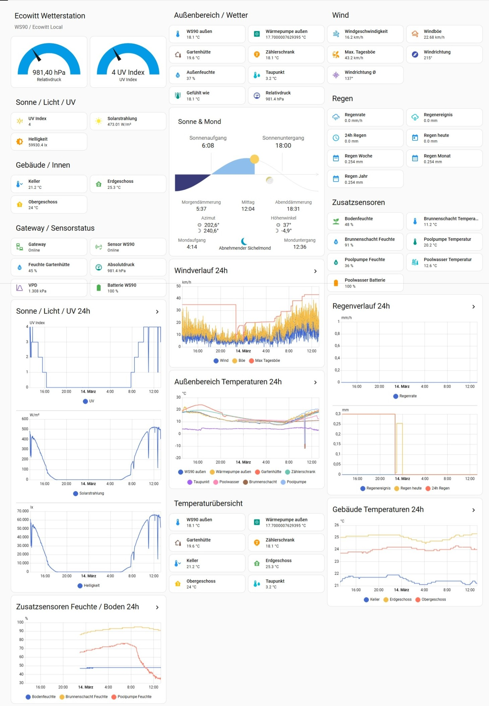
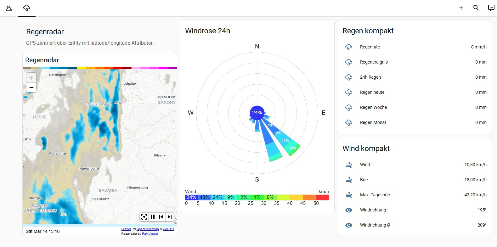

# Home Assistant Weather Dashboard for Ecowitt / WS90 - [DRAFT/Prototype]

A Lovelace dashboard for **Home Assistant** focused on **Ecowitt Local / WS90** sensors.

It is designed to be:
- stable on desktop
- easy to adapt to other entity IDs
- clean enough for GitHub publication
- ready for extra Ecowitt sensors such as soil moisture, pool water, shaft/pump sensors, and radar/windrose views

## DEMO





## Features

- Main weather dashboard for daily use
- Separate radar page
- Wind, rain, UV, solar radiation and pressure overview
- Outdoor and building temperature graphs
- Additional sensor block for:
  - soil moisture
  - shaft temperature / humidity
  - pump temperature / humidity
  - pool water temperature / battery
- Windrose view on the radar page
- GPS-centered radar using any entity that provides `latitude` / `longitude` attributes

## Required Custom Cards (HACS)

Install these cards via **HACS**:

- Mushroom
- Horizon Card
- Weather Radar Card
- Windrose Card

Depending on your setup, you may also want:
- Ecowitt Local integration
- Home Assistant built-in statistics/history recorder enabled

## Installation

### 1. Install the custom cards
Install the following via HACS:
- `Mushroom`
- `Horizon Card`
- `Weather Radar Card`
- `Windrose Card`

### 2. Add the dashboard YAML
Create a manual Lovelace dashboard or open the raw configuration editor and paste the contents of:

- `weather_dashboard.yaml`

### 3. Verify your entity IDs
This dashboard uses the following entity groups:

#### Main weather entities
- `sensor.ecowitt_outdoor_temp_100XX`
- `sensor.ecowitt_outdoor_humidity_100XX`
- `sensor.ecowitt_dewpoint_100XX`
- `sensor.ecowitt_wind_speed_100XX`
- `sensor.ecowitt_wind_gust_100XX`
- `sensor.ecowitt_max_daily_gust_100XX`
- `sensor.ecowitt_wind_direction_100XX`
- `sensor.ecowitt_wind_direction_avg_100XX`
- `sensor.ecowitt_rain_rate_100XX`
- `sensor.ecowitt_rain_event_100XX`
- `sensor.ecowitt_24h_rain_100XX`
- `sensor.ecowitt_daily_rain_100XX`
- `sensor.ecowitt_weekly_rain_100XX`
- `sensor.ecowitt_monthly_rain_100XX`
- `sensor.ecowitt_yearly_rain_100XX`
- `sensor.ecowitt_uv_index_100XX`
- `sensor.ecowitt_solar_radiation_100XX`
- `sensor.ecowitt_solar_lux_100XX`
- `sensor.ecowitt_pressure_relative`
- `sensor.ecowitt_pressure_absolute`
- `sensor.ecowitt_sensor_chX`
- `sensor.ecowitt_sensor_chY`
- `sensor.ecowitt_battery_100XX`

#### Outdoor / nearby sensors
- `sensor.gg11esphomewp_outdoor_temperature`
- `sensor.ecowitt_temperature_indoor` (used here as *Gartenhütte*)
- `sensor.gg11_thm_123456789_temperature` (used here as *Zählerschrank*)

#### Building sensors
- `sensor.thm_XXXXXXX71`
- `sensor.thm_XXXXXXX17`
- `sensor.thm_XXXXXXX31`

#### Additional Ecowitt sensors
- `sensor.ecowitt_soil_moisture_f1xxx`
- `sensor.ecowitt_temperature_fx`
- `sensor.ecowitt_humidity_fx`
- `sensor.ecowitt_temperature_fxx`
- `sensor.ecowitt_humidity_fxx`
- `sensor.ecowitt_tf_xxxx`
- `sensor.ecowitt_battery_7axx`

If your entity IDs differ, replace them in the YAML.

## Configuration

## How dynamic GPS centering works

```yaml
center_latitude: data.attributes.latitude
center_longitude: data.attributes.longitude
marker_latitude: data.attributes.latitude
marker_longitude: data.attributes.longitude
```

As long as that entity exposes:
- `latitude`
- `longitude`

…the radar will center and place the marker automatically.

## Troubleshooting

### Radar shows no rain
That is normal if there is currently no precipitation in the visible area.

### Radar does not center correctly
Check that your chosen entity really has these attributes:
- `latitude`
- `longitude`

You can inspect them in Developer Tools → States.

### Windrose card fails
If the Windrose card throws an error, first confirm that:
- the card is installed through HACS
- the resource is loaded correctly
- your wind entities have enough recorded history

If needed, temporarily replace the Windrose card with a simple entities card.

### Graphs are empty
Make sure:
- Recorder is enabled
- the entities are not excluded from history
- the sensors have enough history accumulated

### Some values look wrong
Double-check entity IDs. Common mistakes are:
- mixed-up suffixes like `fx`, `fxx`, `7axx`
- old copied IDs from screenshots
- renamed entities after integration reloads

## Recommended repo structure

```text
home-assistant-ecowitt-dashboard/
├── README.md
└── weather_dashboard_final.yaml
```

## Notes

- This version is intentionally kept **desktop-stable** and **simple to maintain**.
- It uses a separate **Radar** view to keep the main weather page clean.
- It is a good base for an open-source GitHub repository.
